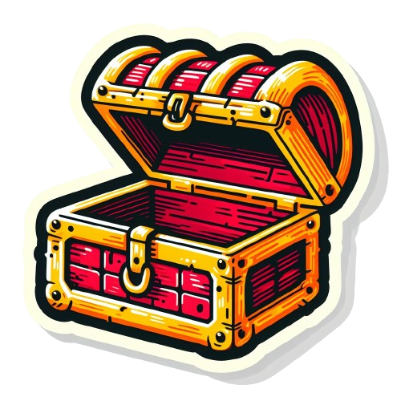
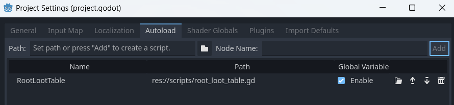
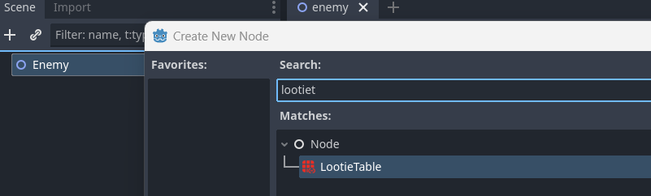
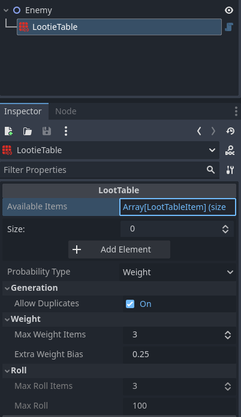
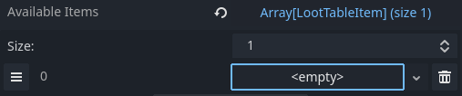
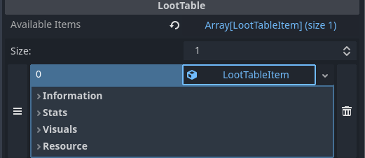
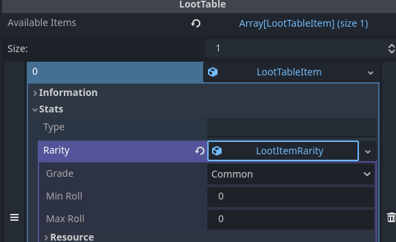

<div align="center">
    

<h3 align="center">Lootie</h3>

  <p align="center">
    Portable loot table for Godot Games
    <br />
    ·
    <a href="https://github.com/ninetailsrabbit/Lootie/issues/new?assignees=ninetailsrabbit&labels=%F0%9F%90%9B+bug&projects=&template=bug_report.md&title=">Report Bug</a>
    ·
    <a href="https://github.com/ninetailsrabbit/Lootie/issues/new?assignees=ninetailsrabbit&labels=%E2%AD%90+feature&projects=&template=feature_request.md&title=">Request Features</a>
  </p>
</div>

<br>
<br>

`Lootie` serves as a tool for game developers to define and manage the random generation of loot items within their games. It allows specifying a list of available items with their respective weights or rarity tiers, enabling the generation of loot with controlled probabilities. The class offers various methods for adding, removing, and manipulating the loot items, along with two primary generation methods: `weight-based` and `roll-tier based`

- [Getting started 💨](#getting-started-)
  - [Global](#global)
  - [Individual node](#individual-node)
    - [LootTable via GDScript](#loottable-via-gdscript)
- [LootTableItem 🟨](#loottableitem-)
  - [Custom Resource Extension](#custom-resource-extension)
  - [Item Mapper Class](#item-mapper-class)
  - [Properties](#properties)
  - [Editor creation](#editor-creation)
  - [Rarity](#rarity)
- [Generate loot 🎲](#generate-loot-)
  - [Generate() method](#generate-method)
  - [Weighted 🎲](#weighted-)
  - [Roll tier 🎲](#roll-tier-)
- [Add or Remove items via GDScript](#add-or-remove-items-via-gdscript)

# Getting started 💨

You can use it in three ways:

## Global

Add it as an autoload and have a fixed base of items from which to obtain the corresponding generations. This is useful for loots that are always available and whose percentages may change as the player progresses through the game.

It is recommended to create a script that extends from `LootTable` so that it is the singleton and can continue to add the original `LootTable` individually as a node.

```swift file=root_loot_table.gd
class_name RootLootTable extends LootTable
//...
```



## Individual node

`LootTable` can be added as a node and set some items for this particular loot. This is a useful way to define loots based on enemies, chests, or levels where you want to only generate items of a particular type and rarity for that entity, for example.





### LootTable via GDScript

The `LootieTable` node can be initialied with the `_init` constructor and receive an array of `LootTableItem`, if in the editor exists already defined `LootTableItem` Resources, the ones passed on the constructor will be appended.

This approach uses a different name `LootTable` as `LootieTable` is defined by the plugin to be added as a node, but the internal script is the same.

```swift
var items := [Item1, Item2, Item3]

var lootie_table := LootTable.new(items)

var loot := lootie_table.generate(3)
//...

```

# LootTableItem 🟨

`LootTableItem` resource serves as a placeholder for representing items that the `LootTable` plugin uses for loot generation. While these items may not directly correspond to the actual items in your game, they provide the necessary information for the plugin to identify and handle loot generation.

**There are two ways to use this items on your game:**

## Custom Resource Extension

- Create a new resource type that extends the base `LootTableItem` resource provided by the plugin.
- Add additional properties to your custom resource that align with your game's item data structure.
- Utilize this custom resource type when defining items in the LootTable plugin.

## Item Mapper Class

- Implement an intermediate class or function that acts as an item mapper.
- This mapper should receive a `LootTableItem` resource as input.
- Based on the `LootTableItem properties`, the mapper should translate or transform the data into an equivalent Item class or resource from your game's data model.
- When generating loot using the LootTable plugin, use the mapper to convert the generated `LootTableItem` instances into your game's Item objects

**Something like this, as individual cases can be very different, I hope it gives you an idea of where to start.** I'm using new but you can get the item from your own database or global dictionary where the `id already` returns the item from your game.

Try it out and see what works best for you.

```swift
//item_mapper.gd
class_name ItemMapper


func map(loot_item: LootTableItem) -> MyGameItem:
     var item := MyGameItem.new(loot_item.id)
     item.name = loot_item.name

     //.. more properties

     return item


// Or using directly the other resource
// my_game_item.gd
class_name MyGameItem extends Resource

@export var id: String
@export var name: String
@export var damage: int
@export var heal: int
@export var consumable: bool = false


static func from(loot_item: LootTableItem) -> MyGameItem
    var item := MyGameItem.new(loot_item.id)
    item.name = loot_item.name

    //.. more properties

    return item
```

## Properties

The LootTableItem resource has several essential properties that must be defined for proper functionality:

- `id`: A unique identifier for the item. It should not be repeated among all items.
- `rarity`: A reference to a `LootItemRarity` resource that defines the item's rarity level.
- `weight`: A numerical value representing the weight of the item in probability calculations.

The `LootTableItem` offers a static helper method `from_dictionary()` that allows you to create new `LootTableItem` resources directly from dictionaries. This method requires the dictionary keys to match the property names of the LootTableItem resource _(e.g., id, rarity, weight)_. While the dictionary doesn't need to be complete, the method assigns default values for any missing properties. This provides a convenient way to create `LootTableItem` resources programmatically or from external data sources.

```swift
class_name LootTableItem extends Resource

/// This resource does not have to represent the in-game item of your game.
/// It is used to roll on the loot table and get the important information of the item to drop and that you could map to yours.

@export_group("Information")
@export var id: StringName
@export_file var file
@export var name : String
@export var abbreviation : String
@export_multiline var description : String

@export_group("Stats")
@export var type: String
@export var rarity: LootItemRarity
@export var weight := 1.0 ## This is the important parameter as more weight more chances to appear in a roll.
@export var value := 1.0
@export var usable := false
@export var equippable := false

@export_group("Visuals")
@export var icon : Texture2D
@export var image : Texture2D

var accum_weight := 0.0


static func from_dictionary(data: Dictionary = {}) -> LootTableItem:
	var item = LootTableItem.new()
	var valid_properties = item.get_property_list().map(func(property: Dictionary): return property.name)

	for property: String in data.keys():
		if valid_properties.has(property):
			item[property] = data[property]

	return item
```

## Editor creation

In addition to the static helper method, you can also create `LootTableItem` resources directly within the Godot editor





## Rarity

This resource represents the rarity of the item

```swift
class_name LootItemRarity extends Resource

enum ITEM_RARITY { COMMON, UNCOMMON, RARE, LEGENDARY, MYTHIC, ETERNAL, ABYSSAL, COSMIC, DIVINE} ## Expand here as to adjust it to your game requirements

## The grade of rarity for this item
@export var grade := ITEM_RARITY.COMMON
## The minimum value in range to be available on the roll pick
@export var min_roll: float
## The maximum value in range to be available on the roll pick
@export var max_roll: float
```

You can assign directly the rarity on the editor



# Generate loot 🎲

The cool thing of this plugin is that with a simple method you can generate loot in record time. There are two types of techniques this plugin provides for you.

**_The `LootTableItem` resources inside a `LootTable` are never deleted or altered. A copy is created each time a new generation is to be disposed of._**

## Generate() method

This method takes an integer `times` parameter and an optional type parameter _(defaulting to the `probability_type` property value)_ and returns an array of generated `LootTableItem` objects. It internally utilizes either the `weight()` or `roll_tier()` method based on the provided type.

`times` does not represent the amount of items to generate but the **number of times the generation will be applied** so more `times` means more probability to get the items from this loot table.

if `allow_duplicates` is enabled, an item can be repeated in the returned generation, disable it to only return unique items.

**Basic example**

```swift
extends Node2D

@onready var loot_table: LootTable = $LootieTable

func _on_death():
    var items := loot_table.generate(5)
    //... do stuff
```

You can use the `probability_type` you want on the generation function each time, by default uses the exported `probability_type` parameter:

```swift
loot_table.generate(5, LootieTable.ROLL_TIER)
// Or
loot_table.generate(5, LootieTable.WEIGHT)

```

## Weighted 🎲

This method iterates through the available items, calculating their cumulative weights and randomly selecting items based on the accumulated weight values. It repeats this process for the specified `times parameter`, potentially returning up to `max_weight_items` items while considering the `allow_duplicates` flag.

Each `LootTableItem` has a `weight` variable, the greater the weight the more probably to be returned on the generation. So higher values for common rarities and lower for higher rarities.

- `max_weight_items`: Defines the maximum amount of items that this generation can return, so even if you use an higher number of `times` the items returned will be this amount.
- `extra_weight_bias`: Act as a little boost or help to be more probably to generate loot on this generation.

## Roll tier 🎲

This method generates random numbers within the specified `max_roll` range and compares them to the defined rarity tiers of the available items. Based on the roll results, it randomly selects items corresponding to the matching rarity tiers, repeating for the specified times parameter and potentially returning up to `max_roll_items` while considering the `allow_duplicates` flag

- `max_roll_items`: Defines the maximum amount of items that this generation can return, so even if you use an higher number of `times` the items returned will be this amount
- `max_roll`: The maximum number to delimit the roll value ranges, so a value of 100 means that a roll between 0-100 will be generated. This is important because items with `min_roll` > 100 will not be reached on this roll tier generation.

As you notice in `LootItemRarity` there are two properties that works as a range:

- `min_roll`: The minimum roll value to be valid as posibly generated
- `max_roll`: The maximum roll value to be valid as posibly generated.

So if my item has a `min_roll` of 5 and `max_roll` of 20. Only values between 5 and 20 in each roll tier generation will be valid to return this item.

Higher roll ranges for an item in `roll_tier` generations means more probabilities to be returned.

Imagine I defined a `LootTable` with a `max_roll` of 100, so in each generation a random number between 0-100 will be randomly calculated. If the number is 7.55, items where this number falls within the valid range will be candidates for return.

# Add or Remove items via GDScript

This plugin provides a few helper functions to add or remove items on runtime:

`func add_items(items: Array[LootTableItem] = []) -> void`

`func add_item(item: LootTableItem) -> void`

`func remove_items(items: Array[LootTableItem] = []) -> void`

`func remove_item(item: LootTableItem) -> void`

`func remove_items_by_id(item_ids: Array[StringName] = []) -> void`

`func remove_item_by_id(item_id: StringName) -> void`
